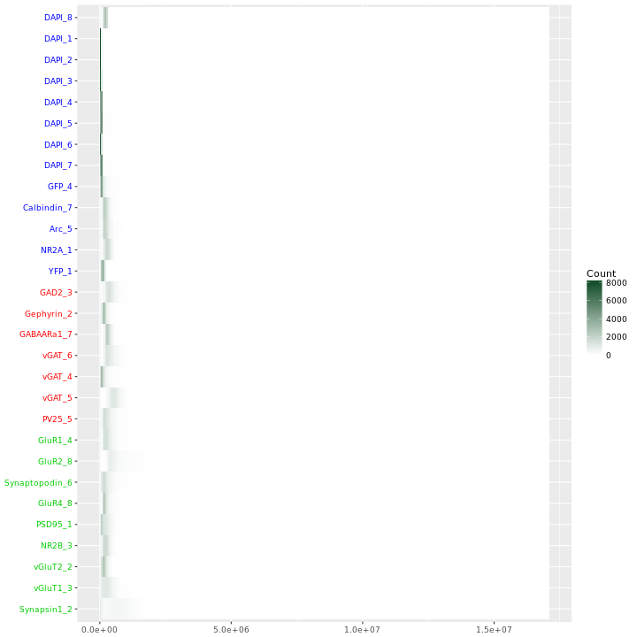
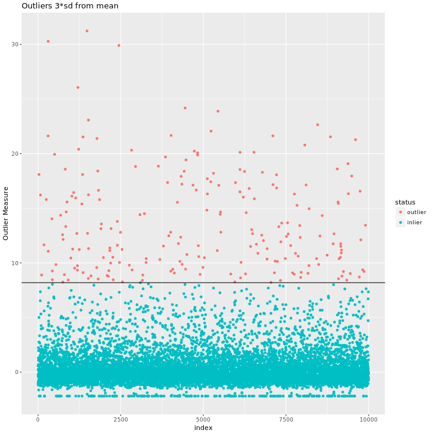
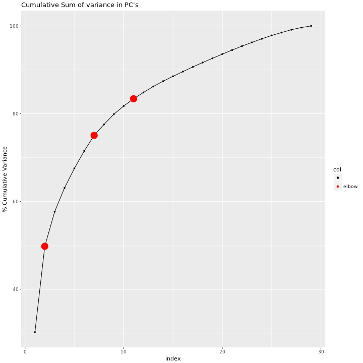
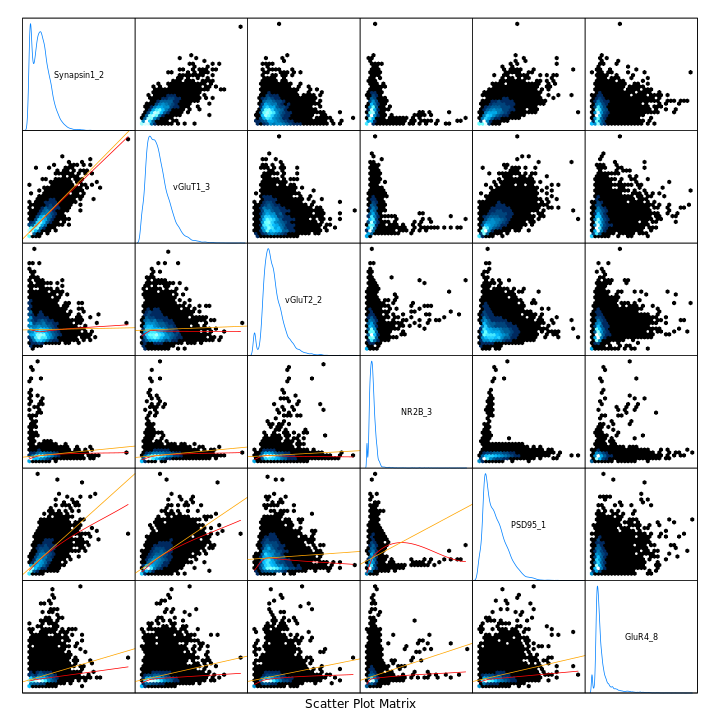
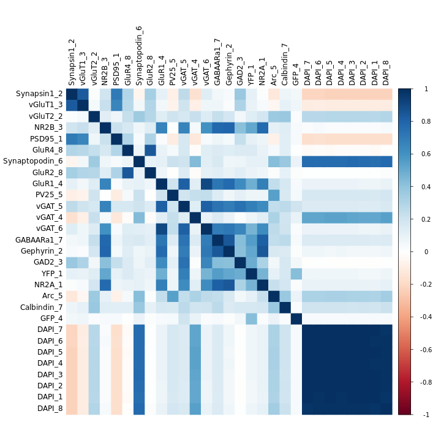
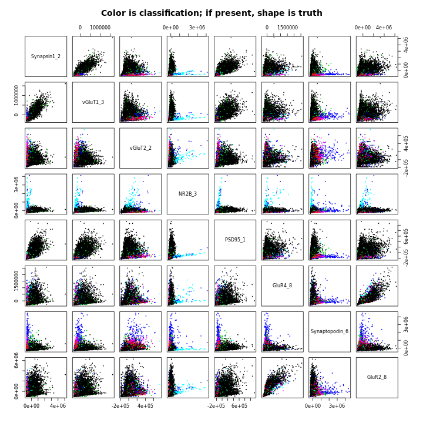
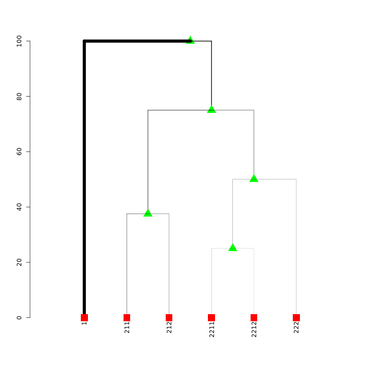
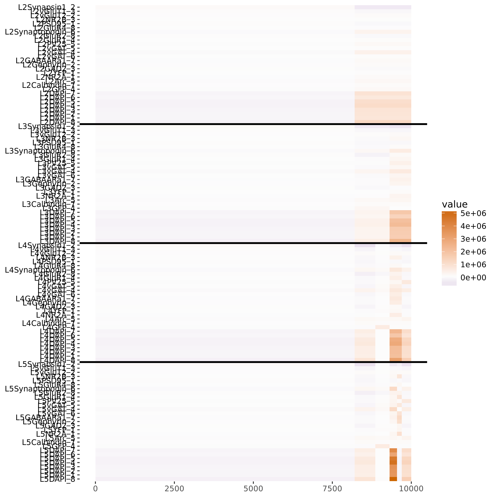
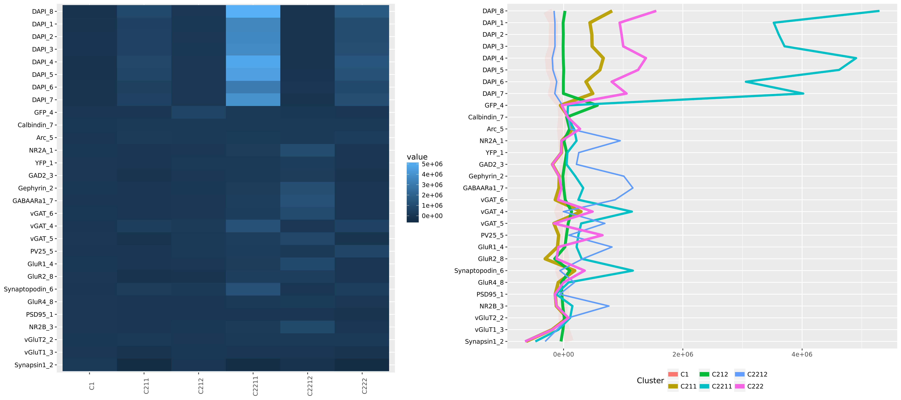

# Daily Report 20170425
Jesse L. Patsolic  

## Accomplishments 
- My code was able to process resultVol\_{1,2,3,7} for Ex12R76 today.

## Next Steps
- rebuild the docker to incorporate updates to meda including color fixes
- run meda on the first principal component of the DAPI features.
- Continue pulling data. 

## Plots from today:

#### 1-d heatmap

#### Outliers

#### Cumulative Variance

#### Paired 2-d kernel density estimates

#### Correlation plot

#### Hierarchical GMM pairs plot

#### Hierarchical GMM dendrogram

#### Stacked means plot

#### Cluster means plot

